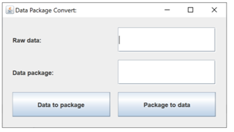
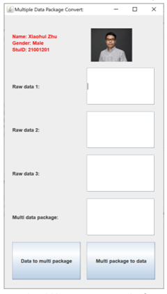
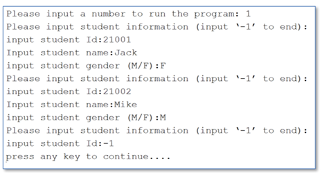
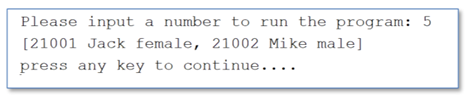

# CPT105 Introduction to Programming in Java 2021-2022 S1 Coursework 3 Task Sheet

## Overview

Coursework 3 consists of three parts: Part A, B, and C.

The learning outcomes of CPT105 Intro to Programming in Java include equipping you to understand and appreciate the principles of Object-Oriented Programming. We also want you to be competent to design, write, test and debug programs in Java. Part

A and Part B are designed to start you in those directions, where you will write your own classes and methods.

In addition, you are also expected to be aware of the design and the good
documentation of a finished program. Part C will help you achieve that goal.
Coursework 3 is 70% of your final mark, and it is an individual project.

## Timeline and Deliverables

|          |                                   |                         |
| -------- | --------------------------------- | ----------------------- |
| Week 10: | Tuesday 23 November 2021, 00:00   | CW3 Task Sheet released |
| Week 15: | Saturdary 26 December 2021, 23:59 | Submission due          |

# Part A

In Part A, you are required to write a GUI program to simulate data encapsulation
when we transfer data via the Internet. You should follow the description to produce the correct output. It is further divided into two parts: Part A.1 and A.2.

CW3 Part A will contribute to 35% of the total marks.

## Part A.1 DataPacket (15 marks)

We usually transfer data packets via the Internet. Usually, a data packet is composed of several components: the frame head, frame tail, length of data, data, and the CRC code. Table 1 below shows the detailed packet structure used in the question.

| HEader | data length | Data Segment |   CRC   |  tail  |
| :----: | :---------: | :----------: | :-----: | :----: |
| 1 Byte |   1 Byte    |   N Bytes    | 2 Bytes | 1 Byte |

In Table 1, we use 2 hexadecimal constants of ```AA``` and ```BB``` to represent the head and the tail of a data packet (Header and Tail columns), respectively, one byte to represent the length of the data segment and 2 bytes to represent the CRC code of the data segment. 

We should encapsulate the data into the data segment and convert the data packet to a hexadecimal string before we send the data via the Internet. 

CRC code is used to verify whether the data packet is changed during the transmission. The main procedure of the data encapsulation is as follows: 

1. Convert each character in the data string into a hexadecimal value.

2. Calculate a CRC code for the hexadecimal string.

3. Combine the header, data length, data segment, CRC code and tail into a data packet.

   For example, we want to send a string ```123A``` to a remote user via the Internet.

   1. First, we should convert the string ```123A``` into a hexadecimal value of ```31323341```. 
      1. ```31```, ```32```, ```33``` and ```41``` are the hexadecimal value of each character in the data string ```123A```. 
   2. Second, we can calculate and get a CRC code ```7BD7``` based on the hexadecimal string ```31323341```. 
   3. Third, we combine the packet header, tail and the data length with the hexadecimal value and CRC code and get a hexadecimal data packet of ```AA04313233417BD7BB```. 
      1. ```AA``` and ```BB``` are the header and tail of the data packet, ```04``` represents the length of data. ```31323341``` is the hexadecimal value of string ```123A```, ```7BD7``` is the CRC code.

```java
/*return a 2 byte CRC code from a byte array*/
private static String getCRC(byte[] bytes) {
    int CRC = 0X0000FFFF;
    final int POLYNOMIAL=0X0000A001;
    int i, j;
    for(i=0; i < bytes.length; i++){
        CRC = CRC^((int) (bytes[i] & 0x000000ff));
        for (j=0; j<8; j++){
            if ((CRC & 0X00000001) != 0){
                CRC = CRC>>1;
                CRC = CRC^POLYNOMIAL;
            } else{
                CRC = CRC>>1;
            }
        }
    }
    String result = Integer.toHexString(CRC).toUpperCase();
    if (result.length()!=4){
        StringBuffer sb = new StringBuffer("0000");
        result = sb.replace(4-result.length(), 4, result).toString();
    }

    return result.substring(2,4) + result.substring(0,2);
}
```

Please follow the steps below to complete the task:

1. Create an empty java project. The project name should be ```Packet```+ your student ID
2. Create a class ```CRC16``` in your project
   1. Copy the method ```getCRC(byte[] bytes)``` into your CRC16 class.
   2. Define an overloading static method ```getCRC(String hexData)```, which can invoke the method ```getCRC(byte[] bytes)``` and return a CRC code based on the string ```hexData```. 
      1. For example, get a CRC code of ```7BD7``` from the hexadecimal string of ```31323341```.

3) Create a class ```DataPacket```.
   1) Define a method ```stringToHex(String str)``` to convert a common string into a hexadecimal string. For example, convert string ```123A``` to ```31323341```.
   2) Define a method ```convertToDataPacket(String data)```, which can encapsulate a string into a data packet and return a hexadecimal string, as Table 1 shows. For example, the method will return ```AA04313233417BD7BB``` if we invoke it with a parameter of ```123A```.
   
4) Create a class ```Q1``` and achieve the following functions in its main method.

   
   1) Create a frame window as below;
   2)  Create a ```DataPacket``` object in the main method;
   3) When users click ```Data to packet``` button, the string in the raw data field can be encapsulated into a data packet string and show in the data packet field.
   4) When users click ```Packet to data``` button, it can retrieve the data string from the data packet field and show it in the raw data field.

## Part A2  MultiDataPacket（20 marks）

Sometimes, we need to transfer several data within one data packet to improve data transmission efficiency. 

For example, if we send two strings of ```ABC``` and ```123A``` in one data packet, the hexadecimal value of the data packet is ```AA034142435085BBAA04313233417BD7BB```. 

In addition, we should check the validation of the data packet before we retrieve data from it. If the data packet is not valid, we should throw an exception. 

Please follow the steps below to complete the task.


1. Create an exception class ```DataPacketException```, which is inherited from ```Exception```.
   
   1. Create a constructor ```DataPacketException (int id, String message)``` to create an exception object with an id and a message string.
   2. Create 1 method to retrieve the id from the exception.
   3. Override the method ```toString()``` to return a string with the id and message
   
2. Create a subclass ```MultiDataPacket``` based on the base class ```DataPacket```.
   1. Create an overloading method ```String[] stringToHex(String[] str)```, which can convert an array of common strings to an array of hexadecimal strings.
   2. Create an overloading method ```String convertToHexDataPacket (String[] data)```, which can convert an array of common strings to a ```MultiDataPacket ```with a single hexadecimal string.
   3. Create a new method ```String[] GetMultiDataFromHexDataPacket (String hexData)``` to retrieve and return several data from the ```MultiDataPacket ```string ```hexData```. The method should validate the header, tail, length and CRC code for each data packet in the string ```hexData``` and throw a ```DataPacketException``` exception when any validation is failed.

3. Create a class ```Q2``` and achieve the following functions in its main method.

   1. Create a frame window as below

      You should list your personal information (name, student Id and gender) and your photo on the top of the window

   2. Create a MultiDataPacket object in the main method;

   3. Users can input strings into the 3 text fields (raw data 1~raw data 3). When users click the ```Data to multi packet``` button, strings in 3 text fields can be encapsulated into a hexadecimal string and shown in the ```multi data packet``` text field.

   4. When users click ```Multi packet to data``` button, we can retrieve all the separate data from the ```multi data packet``` text field and show them in the 3 text fields (raw data 1~raw data 3), respectively.

   5. You should use a message dialogue to show any exceptions raised in your program. Below is an example for your reference.

# Part B

In this part, you will develop a student management system to manage the information of students, courses, grades and teachers.

CW3 Part B will contribute 50% of the total marks.

The system has several classes as follows:

1. create a class ```Course``` to represent the course information of the management system. It should have at least 2 member variables of ```courseId``` and ```courseName```.

2. Create a class ```Person```. It has at least 2 member variables of ```name``` and ```gender```. Gender should be an enum type with two values of ```MALE``` and ```FEMALE```.

3. Create a class ```Student``` inherited from the base class ```Person``` to represent student information. It has at least 1 new member variable of ```stuId```.

4. Create a class ```Teacher``` inherited from the base class ```Person``` to represent teacher information. It has at least 3 new member variables of ```teacherId```, ```loginName``` and ```password```.

5. Create a class ```Grade``` to represent the grade of a module for a student. It has at least 3 member variables of ```stuId```, ```courseId``` and ```grade``` to represent student id, course id and the grade of a course for the student.

6. Complete the class ```Encryption``` by fixing compilation errors and including suitable exception handling, for which we have provided most of the codes, to encrypt and decrypt teacher’s password.

7. Create a class ```FileUtils```, which can be used to create plain text files to save objects of students, teachers, courses and grades, respectively. In addition, it should provide methods to retrieve objects from files. To achieve this, classes of Student, Teacher, Course and Grade should implement an interface of Serializable.

8. Create a class ```DataAccess```, which invokes FileUtils class to create and save objects (Student, Course, Grade and Teacher) into 4 different plain text files. The class should use ArrayList to save objects retrieved from files. In addition, it can search and return objects according to the object’s id. For example, the method ```Student getStudentById(String stuId)``` can search and return a student object by the student Id

9. Create a class ```Q3``` and achieve the following functions in its main method.
   1. Create an operation menu as follows:

   2. Users can input a number to run a related function.

   3. When users input 1, then users can input student’s Id, name and gender to create a student object and append it into a student data file. Users can continuously create several student objects until ```-1``` is inputted. The following picture shows that the user creates 2 student objects and saves them into the student data file.

      

      Operations to add a course, teacher and grade are similar to that of adding a student.

   4. When users input 5, all the student objects should be printed out as follows.When there is no object, it should print out a message as follows to let users know there is no object

      Operations to list course, teacher and grade objects are similar to that of listing student objects.

   5. When users input 9, then users can input the student Id to search and print out the related student object. If the student object does not exist, then print out a string to show that the student object is not found.Operations to search a course and teacher object are similar to that of searching a student object. However, users should input both student Id and course Id to search for a grade object.

10. There are other requirements as follows:

   1. The program can be continuously run until users input 0 to exit.
   2. You should check and avoid duplicate Ids when you create objects.
   3. Exceptions should be caught and handled properly.
   4. The secret key in the Encryption class should be changed to your email address.
   5. Comments for methods and classes are required.

# Part C

In Part C, you will complete the design and the documentation of the programs in Part B and submit one report in PDF format.

Part C will contribute to 15% of the total marks.

## Javadoc comment

Write appropriate Javadoc comments in class ```FileUtils```, generate the Javadoc HTML from that and convert and submit the Javadoc in PDF format. <br>(5 marks)

## Class Diagram

Complete the UML class diagrams of class ```Person```, ```Teacher ```and ```DataAccess ```in one PDF file<br> (10 marks)

*The javadoc and class diagrams should be put into one single PDF report for submission*

# CW  - Additional Notes

## Submission Instructions

You should follow the submission steps below to submit your documents to the Learning Mall.

1. Zip the Whole NetBeans project folder of Part A into one zipped file and upload to the learning mall using the Part A submission link.
2. Zip the whole NetBeans project folder of Part B into one zipped file and upload to the learning mall using the Part B submission link.
3. Upload the single PDF file of Part C to the learning mall using the Part C submission link.

**Late submissions**: The standard University policy on late submissions will apply: 5% of the total marks available for the component shall be deducted from the  assessment mark for each working day after the submission date, up to a maximum of five working days, so long as this does not reduce the mark below the pass mark (40%). 

Submissions more than five working days late will not be accepted.

## On Plagiarism

This coursework is individual work. Plagiarism (e.g. copying materials from other sources without proper acknowledgement) is a serious academic offence.

Plagiarism and collusion will not be tolerated and will be dealt with in accordance with the University Code of Practice on Academic Integrity. Individual students may be invited to explain parts of their code in person, and if they fail to demonstrate an understanding of the code, no credit will be given for that part of the code

This is the end of Coursework 3 Task Sheet.
