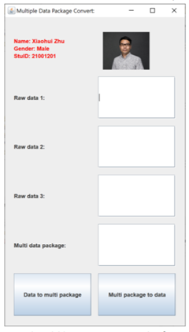
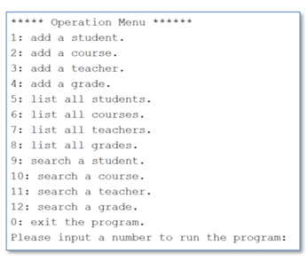
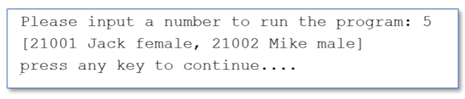
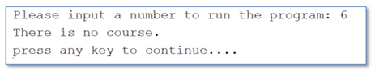
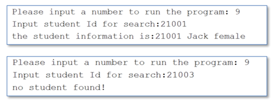
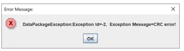

# CPT105 Introduction to Programming in Java 2021-2022 S1 Coursework 3 Task Sheet

## Overview

Coursework 3 consists of three parts: Part A, B, and C.

The learning outcomes of CPT105 Intro to Programming in Java include equipping you to understand and appreciate the principles of Object-Oriented Programming. We also want you to be competent to design, write, test and debug programs in Java. Part

A and Part B are designed to start you in those directions, where you will write your own classes and methods.

In addition, you are also expected to be aware of the design and the good
documentation of a finished program. Part C will help you achieve that goal.
Coursework 3 is 70% of your final mark, and it is an individual project.

## Timeline and Deliverables

|          |                                   |                         |
| -------- | --------------------------------- | ----------------------- |
| Week 10: | Tuesday 23 November 2021, 00:00   | CW3 Task Sheet released |
| Week 15: | Saturdary 26 December 2021, 23:59 | Submission due          |

# Part A

In Part A, you are required to write a GUI program to simulate data encapsulation
when we transfer data via the Internet. You should follow the description to produce the correct output. It is further divided into two parts: Part A.1 and A.2.

CW3 Part A will contribute to 35% of the total marks.

## Part A.1 DataPacket (15 marks)

We usually transfer data packets via the Internet. Usually, a data packet is composed of several components: the frame head, frame tail, length of data, data, and the CRC code. Table 1 below shows the detailed packet structure used in the question.

| HEader | data length | Data Segment |   CRC   |  tail  |
| :----: | :---------: | :----------: | :-----: | :----: |
| 1 Byte |   1 Byte    |   N Bytes    | 2 Bytes | 1 Byte |

In Table 1, we use 2 hexadecimal constants of ```AA``` and ```BB``` to represent the head and the tail of a data packet (Header and Tail columns), respectively, one byte to represent the length of the data segment and 2 bytes to represent the CRC code of the data segment. 

We should encapsulate the data into the data segment and convert the data packet to a hexadecimal string before we send the data via the Internet. 

CRC code is used to verify whether the data packet is changed during the transmission. The main procedure of the data encapsulation is as follows: 

1. Convert each character in the data string into a hexadecimal value.

2. Calculate a CRC code for the hexadecimal string.

3. Combine the header, data length, data segment, CRC code and tail into a data packet.

   For example, we want to send a string ```123A``` to a remote user via the Internet.

   1. First, we should convert the string ```123A``` into a hexadecimal value of ```31323341```. 
      1. ```31```, ```32```, ```33``` and ```41``` are the hexadecimal value of each character in the data string ```123A```. 
   2. Second, we can calculate and get a CRC code ```7BD7``` based on the hexadecimal string ```31323341```. 
   3. Third, we combine the packet header, tail and the data length with the hexadecimal value and CRC code and get a hexadecimal data packet of ```AA04313233417BD7BB```. 
      1. ```AA``` and ```BB``` are the header and tail of the data packet, ```04``` represents the length of data. ```31323341``` is the hexadecimal value of string ```123A```, ```7BD7``` is the CRC code.

```java
/*return a 2 byte CRC code from a byte array*/
private static String getCRC(byte[] bytes) {
    int CRC = 0X0000FFFF;
    final int POLYNOMIAL=0X0000A001;
    int i, j;
    for(i=0; i<bytes.length; i++){
        CRC = CRC^((int) (bytes[i] & 0x000000ff));
        for (j=0; j<8; j++){
            if ((CRC & 0X00000001) != 0){
                CRC = CRC>>1;
                CRC = CRC^POLYNOMIAL;
            } else{
                CRC = CRC>>1;
            }
        }
    }
    String result = Integer.toHexString(CRC).toUpperCase();
    if (result.length()!=4){
        StringBuffer sb = new StringBuffer("0000");
        result = sb.replace(4=result.length(), 4, result).toString();
    }

    return result.substring(2,4) + result.substring(0,2);
}
```

Please follow the steps below to complete the task:

1. Create an empty java project. The project name should be ```Packet```+ your student ID
2. Create a class ```CRC16``` in your project
   1. Copy the method ```getCRC(byte[] bytes)``` into your CRC16 class.
   2. Define an overloading static method ```getCRC(String hexData)```, which can invoke the method ```getCRC(byte[] bytes)``` and return a CRC code based on the string ```hexData```. 
      1. For example, get a CRC code of ```7BD7``` from the hexadecimal string of ```31323341```.

3) Create a class ```DataPacket```.
   1) Define a method ```stringToHex(String str)``` to convert a common string into a hexadecimal string. For example, convert string ```123A``` to ```31323341```.
   2) Define a method ```convertToDataPacket(String data)```, which can encapsulate a string into a data packet and return a hexadecimal string, as Table 1 shows. For example, the method will return ```AA04313233417BD7BB``` if we invoke it with a parameter of ```123A```.
   
4) Create a class ```Q1``` and achieve the following functions in its main method.

   
   1) Create a frame window as below;
   2)  Create a ```DataPacket``` object in the main method;
   3) When users click ```Data to packet``` button, the string in the raw data field can be encapsulated into a data packet string and show in the data packet field.
   4) When users click ```Packet to data``` button, it can retrieve the data string from the data packet field and show it in the raw data field.

## Part A2  MultiDataPacket（20 marks）

Sometimes, we need to transfer several data within one data packet to improve data transmission efficiency. 

For example, if we send two strings of ```ABC``` and ```123A``` in one data packet, the hexadecimal value of the data packet is ```AA034142435085BBAA04313233417BD7BB```. 

In addition, we should check the validation of the data packet before we retrieve data from it. If the data packet is not valid, we should throw an exception. 

Please follow the steps below to complete the task.


1. Create an exception class ```DataPacketException```, which is inherited from ```Exception```.
   
   1. Create a constructor ```DataPacketException (int id, String message)``` to create an exception object with an id and a message string.
   2. Create 1 method to retrieve the id from the exception.
   3. Override the method ```toString()``` to return a string with the id and message
   
2. Create a subclass ```MultiDataPacket``` based on the base class ```DataPacket```.
   1. Create an overloading method ```String[] stringToHex(String[] str)```, which can convert an array of common strings to an array of hexadecimal strings.
   2. Create an overloading method ```String convertToHexDataPacket (String[] data)```, which can convert an array of common strings to a ```MultiDataPacket ```with a single hexadecimal string.
   3. Create a new method ```String[] GetMultiDataFromHexDataPacket (String hexData)``` to retrieve and return several data from the ```MultiDataPacket ```string ```hexData```. The method should validate the header, tail, length and CRC code for each data packet in the string ```hexData``` and throw a ```DataPacketException``` exception when any validation is failed.

3. Create a class ```Q2``` and achieve the following functions in its main method.

   1. Create a frame window as below

      You should list your personal information (name, student Id and gender) and your photo on the top of the window

   2. Create a MultiDataPacket object in the main method;

   3. Users can input strings into the 3 text fields (raw data 1~raw data 3). When users click the ```Data to multi packet``` button, strings in 3 text fields can be encapsulated into a hexadecimal string and shown in the ```multi data packet``` text field.

   4. When users click ```Multi packet to data``` button, we can retrieve all the separate data from the ```multi data packet``` text field and show them in the 3 text fields (raw data 1~raw data 3), respectively.

   5. You should use a message dialogue to show any exceptions raised in your program. Below is an example for your reference.

# Part B

In this part, you will develop a student management system to manage the information of students, courses, grades and teachers.

CW3 Part B will contribute 50% of the total marks.

The system has several classes as follows:

1. create a class ```Course``` to represent the course information of the management system. It should have at least 2 member variables of ```courseId``` and ```courseName```.

2. Create a class ```Person```. It has at least 2 member variables of ```name``` and ```gender```. Gender should be an enum type with two values of ```MALE``` and ```FEMALE```.

3. Create a class ```Student``` inherited from the base class ```Person``` to represent student information. It has at least 1 new member variable of ```stuId```.

4. Create a class ```Teacher``` inherited from the base class ```Person``` to represent teacher information. It has at least 3 new member variables of ```teacherId```, ```loginName``` and ```password```.

5. Create a class ```Grade``` to represent the grade of a module for a student. It has at least 3 member variables of ```stuId```, ```courseId``` and ```grade``` to represent student id, course id and the grade of a course for the student.

6. Complete the class ```Encryption``` by fixing compilation errors and including suitable exception handling, for which we have provided most of the codes, to encrypt and decrypt teacher’s password.

7. Create a class ```FileUtils```, which can be used to create plain text files to save objects of students, teachers, courses and grades, respectively. In addition, it should provide methods to retrieve objects from files. To achieve this, classes of Student, Teacher, Course and Grade should implement an interface of Serializable.

8. Create a class ```DataAccess```, which invokes FileUtils class to create and save objects (Student, Course, Grade and Teacher) into 4 different plain text files. The class should use ArrayList to save objects retrieved from files. In addition, it can search and return objects according to the object’s id. For example, the method ```Student getStudentById(String stuId)``` can search and return a student object by the student Id

9. Create a class ```Q3``` and achieve the following functions in its main method.
   1. Create an operation menu as follows:

   2. Users can input a number to run a related function.

   3. When users input 1, then users can input student’s Id, name and gender to create a student object and append it into a student data file. Users can continuously create several student objects until ```-1``` is inputted. The following picture shows that the user creates 2 student objects and saves them into the student data file.

      

      Operations to add a course, teacher and grade are similar to that of adding a student.

   4. When users input 5, all the student objects should be printed out as follows.When there is no object, it should print out a message as follows to let users know there is no object

      Operations to list course, teacher and grade objects are similar to that of listing student objects.

   5. When users input 9, then users can input the student Id to search and print out the related student object. If the student object does not exist, then print out a string to show that the student object is not found.Operations to search a course and teacher object are similar to that of searching a student object. However, users should input both student Id and course Id to search for a grade object.

10. There are other requirements as follows:

   1. The program can be continuously run until users input 0 to exit.
   2. You should check and avoid duplicate Ids when you create objects.
   3. Exceptions should be caught and handled properly.
   4. The secret key in the Encryption class should be changed to your email address.
   5. Comments for methods and classes are required.

# Part C

In Part C, you will complete the design and the documentation of the programs in Part B and submit one report in PDF format.

Part C will contribute to 15% of the total marks.

## Javadoc comment

Write appropriate Javadoc comments in class ```FileUtils```, generate the Javadoc HTML from that and convert and submit the Javadoc in PDF format. <br>(5 marks)

## Class Diagram

Complete the UML class diagrams of class ```Person```, ```Teacher ```and ```DataAccess ```in one PDF file<br> (10 marks)

*The javadoc and class diagrams should be put into one single PDF report for submission*

# CW  - Additional Notes

## Submission Instructions

You should follow the submission steps below to submit your documents to the Learning Mall.

1. Zip the Whole NetBeans project folder of Part A into one zipped file and upload to the learning mall using the Part A submission link.
2. Zip the whole NetBeans project folder of Part B into one zipped file and upload to the learning mall using the Part B submission link.
3. Upload the single PDF file of Part C to the learning mall using the Part C submission link.

**Late submissions**: The standard University policy on late submissions will apply: 5% of the total marks available for the component shall be deducted from the  assessment mark for each working day after the submission date, up to a maximum of five working days, so long as this does not reduce the mark below the pass mark (40%). 

Submissions more than five working days late will not be accepted.

## On Plagiarism

This coursework is individual work. Plagiarism (e.g. copying materials from other sources without proper acknowledgement) is a serious academic offence.

Plagiarism and collusion will not be tolerated and will be dealt with in accordance with the University Code of Practice on Academic Integrity. Individual students may be invited to explain parts of their code in person, and if they fail to demonstrate an understanding of the code, no credit will be given for that part of the code

This is the end of Coursework 3 Task Sheet.


# java-cptcw3

# Part A

在A部分，你需要编写一个GUI程序来模拟我们通过Internet传输数据时的数据封装。 您应该按照说明生成正确的输出。 它进一步分为两部分：A.1 部分和A.2 部分。

我们通常通过互联网传输数据包。通常，一个数据包由几个部分组成：帧头、帧尾、数据长度、数据和CRC码。

| HEader | data length | Data Segment |   CRC   |  tail  |
| :----: | :---------: | :----------: | :-----: | :----: |
| 1 Byte |   1 Byte    |   N Bytes    | 2 Bytes | 1 Byte |

在表1中，我们用```AA```和```BB```这2个十六进制常量分别表示一个数据包的头和尾（Header和Tail列），1个字节表示数据段的长度，2个字节来表示数据段的CRC码。

我们应该将数据封装到数据段中，并将数据包转换为十六进制字符串，然后再通过互联网发送数据。 

CRC 码用于验证数据包在传输过程中是否发生了变化。<br>数据封装的主要过程如下： 

1. 将数据串中的每个字符转换为十六进制值。

2. 计算十六进制串的CRC码。

3. 将头部、数据长度、数据段、CRC码和尾部组合成一个数据包。例如，我们想通过 Internet 向远程用户发送字符串```123A```。

   - 首先，我们应该将字符串```123A```转换为十六进制值```31323341```。 ```31```、```32```、```33```和```41```是数据串```123A```中每个字符的十六进制值。

   - 其次，我们可以根据十六进制字符串```31323341```计算得到一个CRC码```7BD7```。
   - 第三，我们将包头、尾和数据长度与十六进制值和CRC码结合起来，得到一个```AA04313233417BD7BB```的十六进制数据包。 ```AA```和```BB```是数据包的头和尾，```04```代表数据的长度。 ```31323341```是字符串```123A```的十六进制值，```7BD7```是CRC码。

```java
/*return a 2 byte CRC code from a byte array*/
private static String getCRC(byte[] bytes) {
    int CRC = 0X0000FFFF;
    final int POLYNOMIAL=0X0000A001;
    int i, j;
    for(i=0; i<bytes.length; i++){
        CRC = CRC^((int) (bytes[i] & 0x000000ff));
        for (j=0; j<8; j++){
            if ((CRC & 0X00000001) != 0){
                CRC = CRC>>1;
                CRC = CRC^POLYNOMIAL;
            } else{
                CRC = CRC>>1;
            }
        }
    }
    String result = Integer.toHexString(CRC).toUpperCase();
    if (result.length()!=4){
        StringBuffer sb = new StringBuffer("0000");
        result = sb.replace(4=result.length(), 4, result).toString();
    }

    return result.substring(2,4) + result.substring(0,2);
}
```

请按照以下步骤完成任务：

1. 创建一个空的java项目。项目名称应为```Packet```+您的学号。
2. 在你的项目中创建一个类```CRC16```。
   1. 将方法```getCRC(byte[] bytes)```复制到您的 CRC16 类中；
   2. 定义一个重载静态方法```getCRC(String hexData)```，它可以调用方法```getCRC(byte[] bytes)```并根据字符串```hexData```返回一个CRC码。 例如，从```31323341```的十六进制字符串中得到```7BD7```的CRC码。

3. 创建一个类```DataPacket```。

   1) 定义一个方法```stringToHex(String str)```将普通字符串转换为十六进制字符串。例如，将字符串```123A```转换为```31323341```。
   2) 定义一个方法```convertToDataPacket(String data)```，可以将一个字符串封装成一个数据包，返回一个16进制的字符串，如表1所示。 例如，如果我们使用参数```123A```调用该方法，将返回```AA04313233417BD7BB```。
   3) 定义一个方法```getDataFromDataPacket(String hexData)```，它可以从数据包的十六进制字符串中检索字符串数据。这方法应该检查数据包的头部和尾部的有效性，数据的长度和 CRC 码。 例如，如果我们使用```AA04313233417BD7BB```的参数调用该方法将返回```123A```。

4. 创建一个类```Q1```，在其main方法中实现如下功能。

   

   1) 创建一个框架窗口，如下所示；
   2) 在main方法中创建一个DataPacket对象；
   3) 当用户点击```Data to packet```按钮时，可以将原始数据字段中的字符串封装成数据包字符串并显示在数据包字段中；
   4) 当用户点击```Packet to data```按钮时，它可以从数据包字段中检索数据字符串并显示在原始数据字段中。

## A2 部分 MultiDataPacket（20 分）

有时，我们需要在一个数据包内传输多个数据，以提高数据传输效率。 例如，如果我们在一个数据包中发送两个字符串```ABC```和```123A```，则该数据包的十六进制值为```AA034142435085BBAA04313233417BD7BB```。 

此外，我们应该在从中检索数据之前检查数据包的有效性。 如果数据包无效，我们应该抛出异常。 

请按照以下步骤完成任务。

1. 创建异常类```DataPacketException```，继承自```Exception```。

   1. 创建一个构造函数```DataPacketException(int id, String message)```来创建一个带有 id 和消息字符串的异常对象。
   2. 创建 1 个方法来从异常中检索 id。
   3. 覆盖方法```toString()```以返回带有 id 和消息的字符串。

2. 在基类```DataPacket```的基础上创建一个子类```MultiDataPacket```。

   1. 创建重载方法```String[] stringToHex(String[] str)```，可以将普通字符串数组转换为十六进制字符串数组。
   2. 创建重载方法```String convertToHexDataPacket(String[] data)```，可以将普通字符串数组转换为单个十六进制字符串的MultiDataPacket。
   3. 创建一个新方法```String[] getMultiDataFromHexDataPacket(String hexData)```以从 MultiDataPacket 字符串```hexData```中检索并返回多个数据。 该方法应验证字符串```hexData```中每个数据包的头、尾、长度和 CRC 码，并在任何验证失败时抛出```DataPacketException```异常。

3. 创建一个类```Q2```，在其main方法中实现如下功能。

   1. 创建一个框架窗口如下

      

      您应该在窗口顶部列出您的个人信息（姓名、学生 ID 和性别）和您的照片。

   2. 在main方法中创建一个MultiDataPacket对象；

   3. 用户可以在 3 个文本字段（原始数据 1~原始数据 3）中输入字符串。

   4. 当用户点击```数据转多包```按钮时，可以将3个文本字段中的字符串封装成一个16进制字符串，显示在```多数据包```文本字段中。

   5. 当用户单击```Multi packet to data```按钮时，我们可以从```multi packet to data```文本字段中检索所有单独的数据，并将它们分别显示在 3 个文本字段（原始数据 1~原始数据 3）中。

   6. 您应该使用消息对话框来显示程序中引发的任何异常。下面是一个例子供您参考。

      


# Part B

在这部分，你将开发一个学生管理系统来管理学生、课程、年级和教师的信息。

该系统有以下几个类：

1. 创建一个类```Course```，代表管理系统的课程信息。它应该至少有```courseId```和```courseName```两个成员变量。

2. 创建一个类```Person```。它至少有```name```和```gender```两个成员变量。性别应该是一个枚举类型，具有```MALE```和```FEMALE```两个值。

3. 创建一个继承自基类```Person```的类```Student```来表示学生信息。它至少有 1 个新成员变量```stuId```。

4. 创建一个继承自基类```Person```的类```Teacher```来表示教师信息。它至少有 3 个新的成员变量```teacherId```、```loginName```和```password```。

5. 创建一个```Grade```类来代表学生某个模块的成绩。它至少有```stuId```、```courseId```和```grade```三个成员变量，分别代表学生ID、课程ID和该学生的课程成绩。

6. 通过修复编译错误和适当的异常处理来完成```加密```课程，我们提供了大部分代码，用于加密和解密教师密码。

7. 创建```FileUtils```类，可以创建纯文本文件，分别保存学生、教师、课程和成绩对象。此外，它还应该提供从文件中检索对象的方法。为此，Student、Teacher、Course 和 Grade 类应实现 Serializable 接口。

8. 创建一个```DataAccess```类，它调用FileUtils 类来创建对象（Student、Course、Grade 和Teacher）并将其保存到4 个不同的纯文本文件中。

   该类应该使用 ArrayList 来保存从文件中检索到的对象。此外，它还可以根据对象的 id 搜索和返回对象。例如```Student getStudentById(String stuId)```方法可以通过studentId查找并返回一个student对象

9. 创建一个类```Q3```，在其main方法中实现如下功能。

   1. 创建操作菜单如下：

      

   2. 用户可以输入一个数字来运行相关功能。

   3. 当用户输入 ```1``` 时，用户可以输入学生的 ID、姓名和性别来创建学生对象并将其附加到学生数据文件中。 用户可以连续创建多个学生对象，直到输入```-1```。 下图显示了用户创建了 2 个学生对象并将它们保存到学生数据文件中。

      

      添加课程、教师和年级的操作与添加学生的操作类似。

   4. 当用户输入 5 时，所有学生对象应打印如下当没有对象时，应该打印如下信息让用户知道没有对象。

      

      列出课程、教师和成绩对象的操作与列出学生对象的操作类似。

   5. 当用户输入 9 时，用户可以输入学生 ID 来搜索并打印出相关的学生对象。 如果学生对象不存在，则打印出一个字符串表示没有找到学生对象。搜索课程和教师对象的操作与搜索学生对象的操作类似。 但是，用户应该同时输入学生 ID 和课程 ID 来搜索成绩对象。

10. 其他要求如下：

    1. 程序可以持续运行，直到用户输入 0 退出。
    2. 您应该在创建对象时检查并避免重复的 Id。
    3. 异常应该被捕获并正确处理。
    4. Encryption 类中的密钥应更改为您的电子邮件地址。
    5. 方法和类的注释是必需的。

# Part C

在 C 部分，您将完成 B 部分程序的设计和文档编制，并提交一份 PDF 格式的报告。

## Javadoc 注释

在```FileUtils```类中编写适当的 Javadoc 注释，从中生成 Javadoc HTML，然后以 PDF 格式转换和提交 Javadoc。 

## 类图

在一个 PDF 文件中完成类 Person、Teacher 和 DataAccess 的 UML 类图

*javadoc 和类图应放在一个单独的 PDF 报告中提交。*
